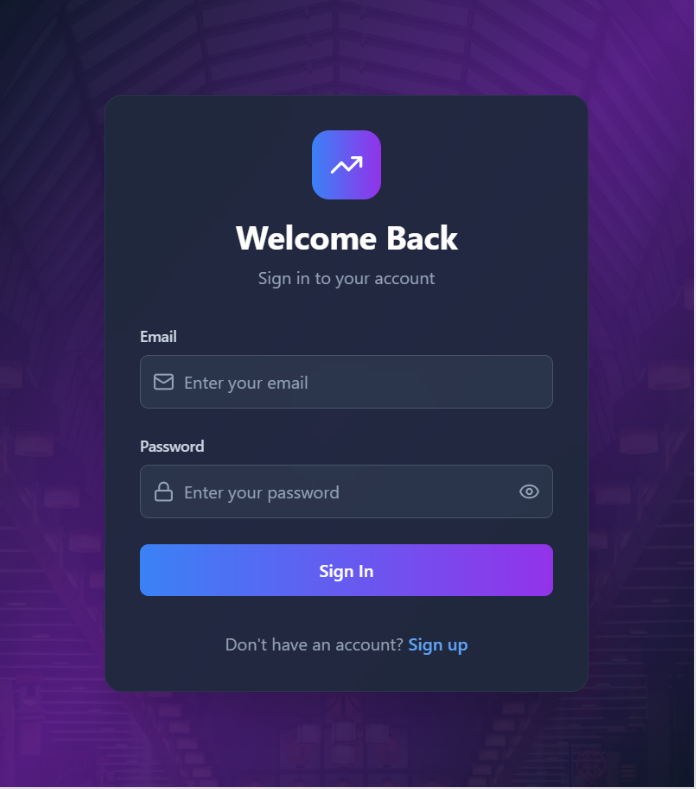
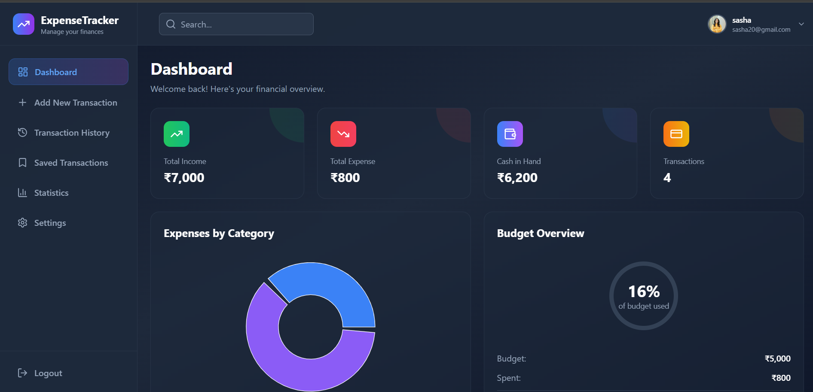
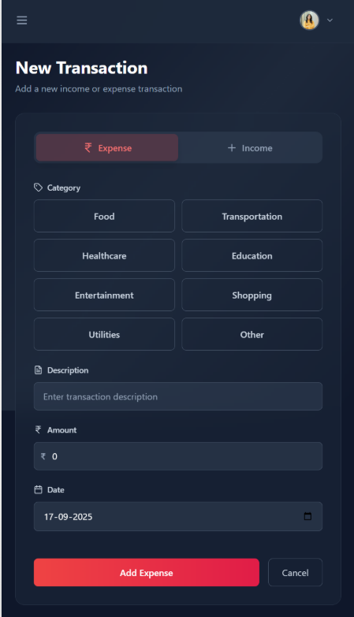
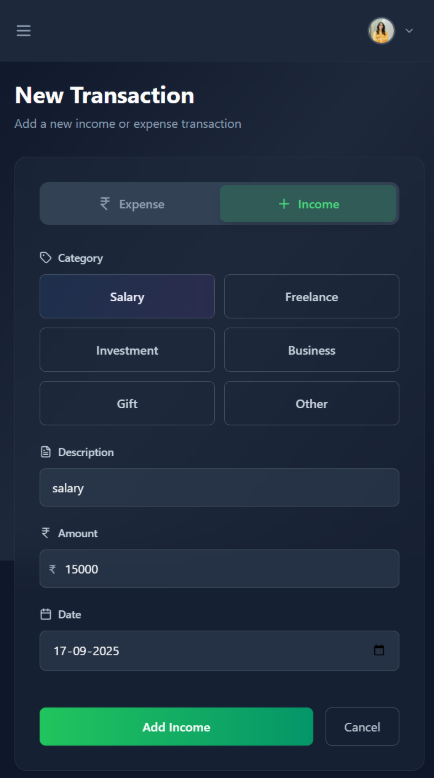
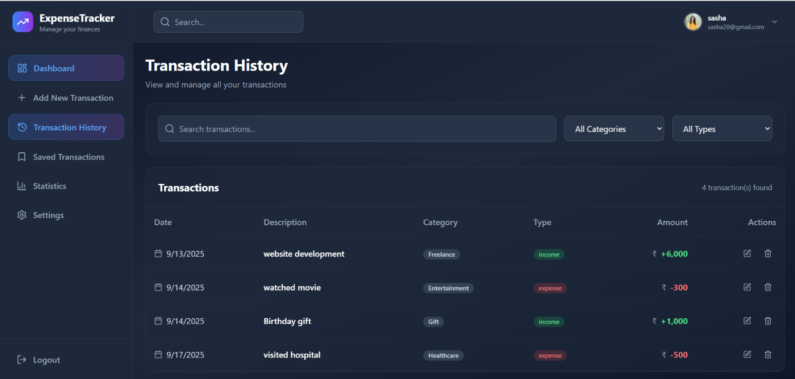
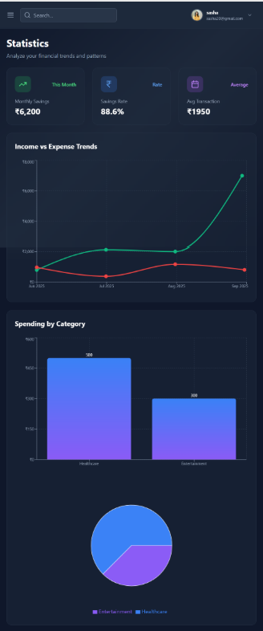
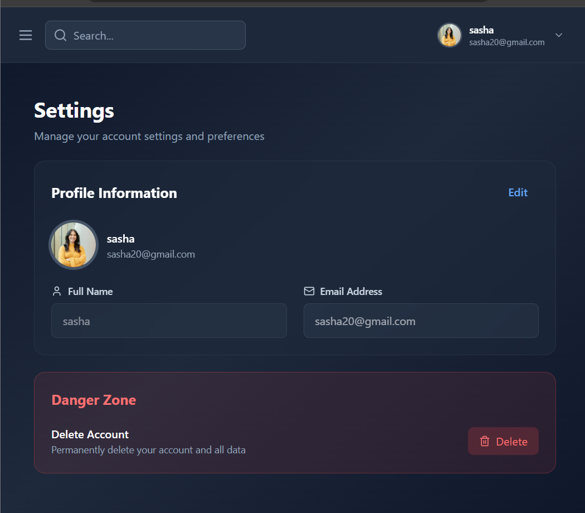

# Expense Tracker 💰

A modern and responsive **Expense Tracker** built using **React, JavaScript, and Tailwind CSS**.  
This project helps users **track their daily expenses, manage budgets, and visualize spending patterns** through interactive charts.
I built this project to **strengthen my frontend development skills** and apply **real-world practices** like responsive UI, reusable components, and data visualization.

## ✨ Features
- ➕ Add, edit, and delete daily expenses  
- 💰 Set and monitor monthly budgets  
- 📊 Interactive charts to view spending insights  
- 📱 Mobile-first, fully responsive design  
- 🔒 Authentication-ready structure for future login/signup  

## 🛠️ Tech Stack
- **React.js**  – UI and component-based architecture  
- **Tailwind CSS** – modern and responsive styling  
- **Chart.js** – data visualization with graphs

## 📂 Project Structure
```text
expense-tracker/
├── public/ # HTML template and static files
├── src/ # Application source code
│ ├── components/ # Reusable UI components
│ │ ├── dashboard/ # Dashboard-related components
│ │ ├── layouts/ # Layout components (header, sidebar, etc.)
│ │ └── pages/ # Main pages (Dashboard, Transactions, Settings, etc.)
│ ├── contexts/ # React Context for state management
│ ├── App.jsx # Main React component
│ ├── cors.json # Firebase CORS configuration
│ ├── firebase.js # Firebase configuration and setup
│ ├── index.css # Global styles and Tailwind setup
│ └── main.jsx # React entry point
├── .gitignore # Git ignored files
├── eslint.config.js # ESLint configuration
├── index.html # HTML entry point
├── package.json # Project dependencies and scripts
├── package-lock.json # Dependency lock file
├── postcss.config.js # Tailwind/PostCSS configuration
├── README.md # Project documentation
├── tailwind.config.js # Tailwind configuration
└── vite.config.js # Vite configuration

## 🚀 Getting Started

### 1️⃣ Clone the repository
```bash
git clone https://github.com/jeenajdas/expense-tracker.git
cd expense-tracker

2️⃣ Install dependencies
npm install

3️⃣ Configure Firebase

Create a Firebase project from [Firebase Console](https://console.firebase.google.com/).

Enable **Authentication** (Email/Password or Google Sign-In).

Enable **Firestore Database** for storing expenses.

Copy your Firebase config and replace it inside `src/firebase.js`.

Example `firebase.js`:
```javascript
import { initializeApp } from "firebase/app";
import { getAuth } from "firebase/auth";
import { getFirestore } from "firebase/firestore";

const firebaseConfig = {
  apiKey: "YOUR_API_KEY",
  authDomain: "YOUR_PROJECT_ID.firebaseapp.com",
  projectId: "YOUR_PROJECT_ID",
  storageBucket: "YOUR_PROJECT_ID.appspot.com",
  messagingSenderId: "YOUR_SENDER_ID",
  appId: "YOUR_APP_ID"
};

const app = initializeApp(firebaseConfig);
export const auth = getAuth(app);
export const db = getFirestore(app);

4️⃣Run the app
npm run dev

5️⃣ Build for production
npm run build

## 📸 Screenshots

### 🔑 Login Page  


###🔑SignUp Page


### 📊 Dashboard  


### ➕ Add Expense  


### ➕ Add Income


### Transaction History


### Statistics


### Settings

